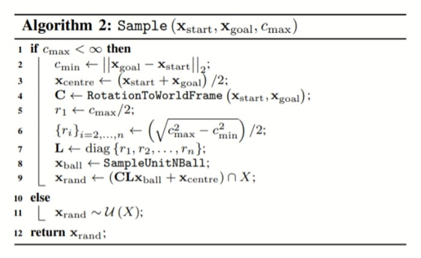

# Informed-RRTstar-with-Bezier
The repository implements the informed RRT*(rapidly exploring random tree) algorithm optimized using Bezier curve and integrates it in the nav2 path planner under ros2 humble.

## use the Informed RRT* for path planning
<p align="center">
  
</p>

## use the third-order Bezier curve to smooth the path
<p align="center">
  
</p>
<p align="center">
  
</p>

## Use Informed-RRTstar-with-Bezier
```bash

$ git clone https://github.com/Y250HT/Informed-RRTstar-with-Bezier.git

$ cd Informed-RRTstar-with-Bezier

$ colcon build

$ . install/setup.bash

$ ros2 launch nav2_bringup tb3_simulation_launch.py headless:=False params_file:=YOUDIRECTORY/Informed-RRTstar-with-Bezier/nav2_params.yaml
```
